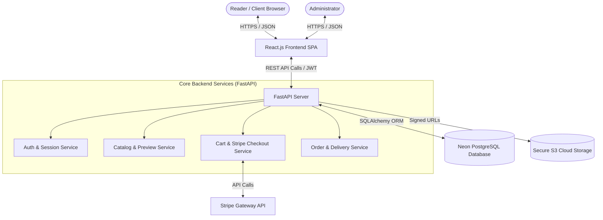
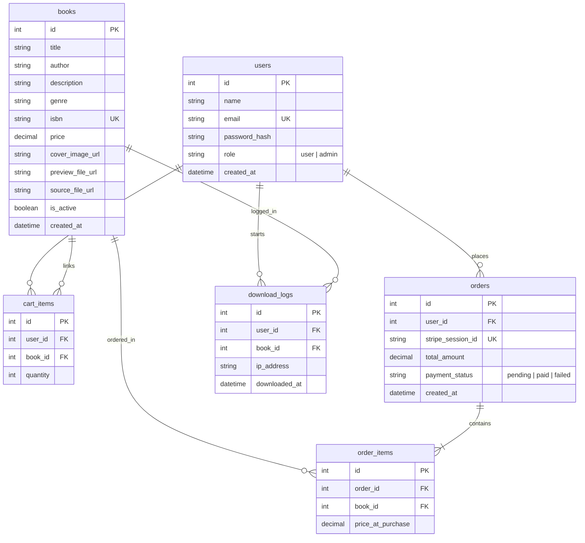
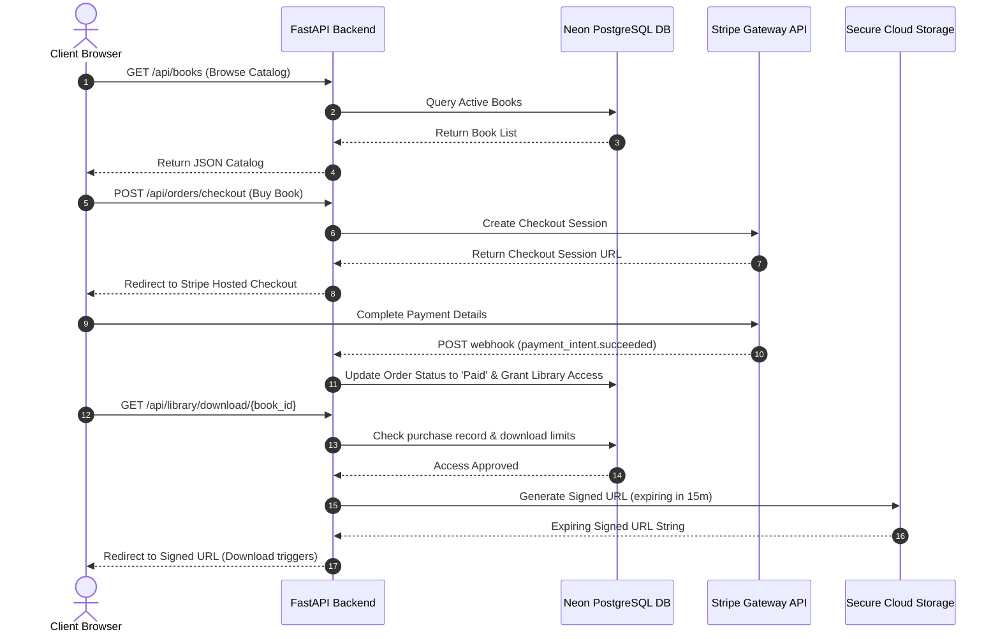

# Architectural Design Document (ADD)
## Project: Digital E-Book System ("E-Book Hub")

---

### Document Control
| Version | Date | Author | Description of Changes | Status |
| :--- | :--- | :--- | :--- | :--- |
| v1.0 | 2026-07-06 | Lead Systems Architect | Initial System Architecture and DB Schema | Completed |

---

## 1. Introduction

### 1.1 Purpose of the System
The **Digital E-Book System ("E-Book Hub")** is built to provide an optimized, secure e-commerce storefront for selling and consuming digital books (E-Books). Unlike physical e-commerce systems, this platform focuses heavily on:
- **Instant Digital Asset Access:** Providing users secure download options immediately upon payment.
- **Intellectual Property Protection:** Preventing direct hotlinking and unauthorized distribution of digital media assets (PDFs, EPUBs).
- **Simplified Operations:** Allowing non-technical administrators to upload media files, track sales, and audit file access records easily.

### 1.2 High-Level Description
The system is constructed as a modern, decoupled **Client-Server Architecture**.
- **Frontend Client:** A single-page application (SPA) built using **React.js** and Vite, serving a fast, responsive interface for search, shopping, checkout, and reading dashboards.
- **Backend API:** A RESTful API built on **FastAPI (Python 3.10 or 3.11)** which handles route mapping, business rules validation, token-based authentication, and transaction handling.
- **Data & Storage Layer:** Leverages **PostgreSQL (Neon DB)** for relational data persistence and a secure Cloud Object Storage (e.g., AWS S3) for hosting protected E-Book binary files.

---

## 2. Architecture Overview

### 2.1 High-Level System Architecture
The platform is designed around a clean client-server monolith model to maintain rapid development velocity and ensure seamless serverless hosting:



### 2.2 Component Interactions
1. **Catalog Browsing:** The Client SPA requests active book items. FastAPI fetches details from Neon PostgreSQL DB, utilizing connection pools, and returns lightweight metadata.
2. **Reading/Previewing:** When a user clicks "Read Sample", the browser loads a preview document from a public, read-only cloud storage endpoint.
3. **Cart & Checkout:** Selected item IDs are compiled in the cart. During checkout, the client initiates a Stripe checkout session via FastAPI. FastAPI registers the pending order.
4. **Instant Delivery:** Upon Stripe transaction confirmation (handled via secure webhooks), the order status is updated to `Paid`. FastAPI updates the user's library and exposes E-Book download actions.
5. **Secure Downloading:** When downloading a purchased E-Book, the client requests a download link. FastAPI verifies the user's purchase history and download limits, generates a cryptographically signed AWS S3 URL valid for 15 minutes, and redirects the user to download.

---

## 3. Application Architecture

### 3.1 Frontend Design (React.js)
The React client is structured as a component-driven Single Page Application (SPA).
- **Vite Build Engine:** Ensures ultra-fast development reloads and optimized production bundling.
- **State Management:** Uses React Context API (`AuthContext` and `CartContext`) for global session variables and shopping cart items.
- **Routing Module:** Managed via `react-router-dom` with route guards:
  - `Public Routes`: Home, Book Details, Checkout, Registration.
  - `Protected Routes`: My Library, Order History, Profile.
  - `Admin Routes`: Add/Edit Books, View Orders.

#### Directory Layout:
```
frontend/
├── public/                 # Static assets (favicons, manifest)
└── src/
    ├── assets/             # Images and global styles
    ├── components/         # Reusable UI widgets (Navbar, Footer, BookCard, Modal)
    ├── context/            # AuthContext, CartContext
    ├── hooks/              # Custom React hooks (useFetch, useAuth)
    ├── pages/              # Screen components (Home, Details, Cart, Checkout, Library, Admin)
    ├── services/           # Api client (Axios configurations)
    └── App.jsx             # Root component and router configurations
```

### 3.2 Backend Design (FastAPI - Python 3.10 / 3.11)
The backend is built using **Python 3.10 or 3.11** to leverage native async/await performance and type-hinting support in FastAPI.
- **Layered Architecture:** Decouples API endpoints from raw DB logic.
- **Pydantic Validation:** All API inputs and responses are strictly validated using Pydantic schemas.
- **SQLAlchemy ORM:** Used as the object-relational mapping interface for database queries.
- **Alembic Migrations:** Used to track database schema versions over time.

#### Directory Layout:
```
backend/
├── app/
│   ├── config/             # Environment settings & db session setup
│   ├── models/             # SQLAlchemy ORM model definitions
│   ├── schemas/            # Pydantic schema validation structures
│   ├── routers/            # API Route controllers (auth.py, books.py, orders.py)
│   ├── utils/              # Helper modules (auth_helper.py, s3_helper.py)
│   └── main.py             # FastAPI entry point
├── alembic/                # DB migrations configuration and history
├── requirements.txt        # Python library dependencies
└── README.md
```

### 3.3 APIs and Integrations

#### Core Endpoint Specifications:
| Method | Endpoint | Auth Required | Description |
| :--- | :--- | :---: | :--- |
| `POST` | `/api/auth/register` | No | Registers a new user. |
| `POST` | `/api/auth/login` | No | Authenticates user; returns JWT token. |
| `GET` | `/api/books` | No | Lists all active books (supports pagination & filters). |
| `GET` | `/api/books/{id}` | No | Retrieves details of a specific book. |
| `POST` | `/api/books` | Yes (Admin) | Creates a new book entry (includes file upload metadata). |
| `PUT` | `/api/books/{id}` | Yes (Admin) | Updates existing book metadata. |
| `DELETE`| `/api/books/{id}` | Yes (Admin) | Archives/Deletes a book. |
| `POST` | `/api/orders/checkout` | Yes (User) | Initiates a Stripe transaction session. |
| `POST` | `/api/orders/webhook` | No | Stripe Webhook endpoint to confirm payment statuses asynchronously. |
| `GET` | `/api/orders/my-orders`| Yes (User) | Lists purchase history for the logged-in user. |
| `GET` | `/api/orders/all` | Yes (Admin) | Lists all system transactions. |
| `GET` | `/api/library` | Yes (User) | Lists all purchased books in user's library. |
| `GET` | `/api/library/download/{book_id}` | Yes (User) | Generates a signed AWS S3 expiring download URL. |

---

## 4. Data Architecture

### 4.1 Database Design (PostgreSQL Neon DB)
The relational system is hosted on Neon DB, capitalizing on serverless auto-scaling and fast connection management.



### 4.2 Data Flow Diagram



---

## 5. Technology Stack

The stack is curated to ensure optimal speed, developer friendliness, and ease of deployment without Docker containerization.

| Layer | Technology | Version | Purpose & Rationale |
| :--- | :--- | :---: | :--- |
| **Frontend Framework** | React.js | 18+ | Component-driven library with state context for high interactivity. |
| **Frontend Tooling** | Vite | 5+ | Fast compilation, bundling, and hot module replacement. |
| **Backend Runtime** | Python | 3.10 / 3.11 | Fast execution, robust type checking, dynamic libraries. |
| **Backend Framework**| FastAPI | 0.100+ | Asynchronous REST framework utilizing Pydantic for high performance. |
| **ORM** | SQLAlchemy | 2.0+ | Modern SQL compiler and object-relational wrapper. |
| **Database** | Neon PostgreSQL | 15/16 | Serverless Postgres database providing autoscaling storage and pooling. |
| **Payment Gateway** | Stripe SDK | Latest | PCI-compliant payment portal ensuring card details are offloaded. |
| **Asset Storage** | AWS S3 / Cloud Storage | - | Highly durable object store for large static book assets. |
| **Deploy Server** | Render | - | Simple cloud server deployment with direct Git hook synchronization. |

---

## 6. Security Architecture

### 6.1 Authentication and Authorization
- **Stateless Sessions (JWT):** Authenticated users receive an encrypted JSON Web Token stored in an HTTP-only secure cookie, mitigating Cross-Site Scripting (XSS) exposures.
- **Role-Based Access Control (RBAC):** Endpoints are protected by dynamic dependency injection filters (e.g., `get_current_active_admin` vs `get_current_active_user`).

### 6.2 Data Protection & Compliance
- **Password Protection:** Plain passwords must be hashed using `bcrypt` or `argon2` before entering database systems.
- **PCI-DSS Compliance:** Card details are collected via Stripe elements directly in the browser; card numbers never enter or pass through the local database server.
- **Secure File Delivery:** Direct URLs to storage locations are disallowed. Books are stored in private S3 buckets. Users access files via expiring Presigned URLs valid for 15 minutes, preventing file link sharing.
- **CORS Constraints:** Cross-Origin Resource Sharing is set up explicitly to allow traffic ONLY from designated frontend domains.

---

## 7. Non-Functional Considerations

### 7.1 Reliability
- **Connection Pools:** Leverages SQLAlchemy connection pools to avoid database exhaustion on Neon.
- **Auto-Retry Webhooks:** Ensures missed webhook events from Stripe are automatically retried to guarantee order completion.

### 7.2 Maintainability
- **Type Safety:** The backend utilizes strict Pydantic schemas and Python type hints to reduce runtime exceptions.
- **Database Migrations:** Alembic tracks schema histories, ensuring database schemas match code modifications across environments.

### 7.3 Performance
- **Asynchronous Handlers:** Dynamic, IO-bound operations (S3 links, Stripe APIs, DB lookups) are written with `async`/`await` handlers to handle high traffic volumes efficiently.
- **Client Cache Optimization:** Static public book covers and preview extracts are cached locally inside standard client browsers.

### 7.4 Availability
- **Cloud Scale Storage:** Private S3 endpoints ensure 99.999999999% durability of precious digital E-Book source assets.
- **Auto-Failover DB:** Neon's multi-region failover configuration guarantees minimal interruption to active sales funnels.
