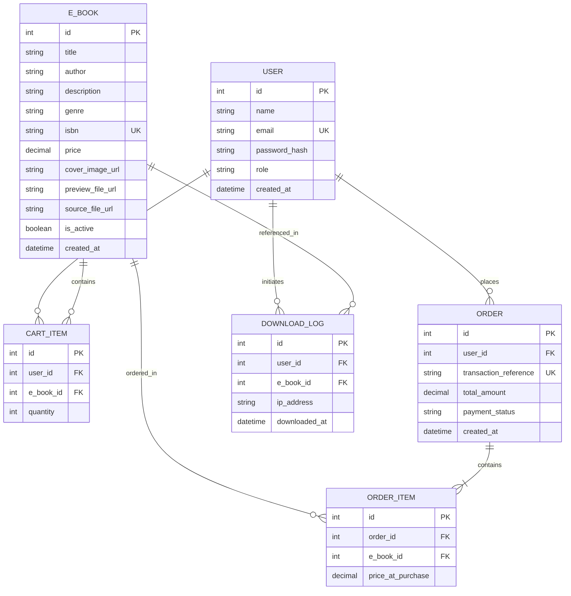

# Business Requirement Document (BRD)
## Project: Digital E-Book System ("E-Book Hub")

---

### Document Control
| Version | Date | Author | Description of Changes | Status |
| :--- | :--- | :--- | :--- | :--- |
| v1.0 | 2026-07-06 | Project Architect | Initial Release of Comprehensive E-Book BRD | Draft |

---

## 1. Executive Summary
The **Digital E-Book System ("E-Book Hub")** is an e-commerce platform designed to provide a premium, modern, and seamless experience for browsing, purchasing, and reading digital books (E-Books). The platform enables customers to discover, preview, purchase, and immediately access their library of digital publications. Simultaneously, it provides store owners and administrators with intuitive tools to manage inventory, catalog details, pricing, promotions, and track customer orders.

The primary business goal is to establish a secure, fast, and high-conversion storefront that minimizes checkout friction, ensures secure payment transactions, protects digital intellectual property, and simplifies back-office administration.

---

## 2. Project Goals & Objectives
- **Frictionless Digital Delivery:** Provide immediate access to purchased E-Books via secure download links or an in-browser library.
- **Conversion-Optimized Checkout:** Implement a modern, multi-device compatible shopping cart and secure payment pipeline to maximize conversion rates.
- **Robust Inventory Control:** Give administrators complete CRUD capabilities to manage digital files, previews, cover art, book metadata (author, genre, ISBN, publication date), and pricing.
- **Order Visibility & Auditing:** Offer transparent order tracking for customers (purchase history, download statuses) and order management panels for admins.
- **High Performance & Security:** Deliver page load times under 1.5 seconds, responsive visuals across device form-factors, and secure payment processing.

---

## 3. Stakeholders & User Personas

### 3.1 Key Stakeholders
- **Store Owner / Business Sponsor:** Monitors revenue, manages catalog curation, sets pricing/promotions, and analyzes performance metrics.
- **Customers (Readers):** Browse, search, preview, purchase, and read/download E-Books.
- **System Administrators:** Maintain platform uptime, manage user accounts, resolve technical anomalies, and handle security audits.
- **Customer Support Representatives:** Resolve payment queries, resend download links, refund orders, and assist customers.

### 3.2 User Personas
- **The Avid Reader (Sarah):** 
  - *Goal:* Quick search by author or genre, previewing the first chapter of a book before purchasing, and accessing purchased items instantly on her tablet.
  - *Pain Point:* Complex checkout flows and slow download link generation.
- **The Book Store Admin (Robert):** 
  - *Goal:* Easily add new titles, upload PDF/EPUB formats, create promotional discounts, and view daily sales summaries.
  - *Pain Point:* Clunky file management systems and lack of bulk action tools.

---

## 4. Scope of Work

### 4.1 In Scope
- **User Authentication & Profiles:** Sign up, sign in, password recovery, and order history dashboards.
- **Interactive E-Book Catalog:** Search, multi-criteria filtering (genre, author, price, rating), and detailed product pages with cover previews.
- **E-Book Preview System:** Ability for customers to read a limited sample (e.g., first 5-10 pages or a specific preview file) before buying.
- **Shopping Cart & Checkout:** Persistent cart, discount code application, and secure payment processing (simulated or integration-ready e.g., Stripe).
- **Secure Digital Delivery:** Generation of expiring, secure download links and a persistent "My Library" space for logged-in users.
- **Admin Dashboard:**
  - Product Management (CRUD: Title, Author, Description, Category, Pricing, Cover Image URL/File, Book File, Preview File).
  - Order Management (View orders, search by transaction ID/user, cancel orders, manually trigger link regenerations).
  - Customer Management (View active users, disable/enable accounts).

### 4.2 Out of Scope
- **Native Mobile Apps:** The initial launch will rely exclusively on a responsive Web App.
- **Physical Book Logistics:** Warehousing, physical shipping, and inventory weight-based shipping calculations (Platform is restricted to digital goods).
- **In-App EPUB Reader:** The MVP will support direct secure downloads (PDF/EPUB) rather than embedding a complex reflowable EPUB reading engine.
- **Multi-Vendor Marketplace:** Platform is single-merchant only; no third-party sellers.

---

## 5. Functional Requirements (FR)

### 5.1 User Authentication & Profile Module
- **FR-1.1 (Registration):** The system shall allow new users to register using an email, password, and full name.
- **FR-1.2 (Social Login - Optional):** The system should provide hooks for OAuth (Google/Apple) for faster signup.
- **FR-1.3 (Secure Login):** The system must authenticate users securely and maintain active sessions with secure tokens (JWT or HTTP-only cookies).
- **FR-1.4 (User Dashboard):** Registered users must have access to a dashboard displaying:
  - **My Library:** Instant access to all purchased E-Books.
  - **Order History:** Historic receipts, transaction amounts, and dates.
  - **Profile Settings:** Account details and password updates.

### 5.2 E-Book Catalog & Discovery Module
- **FR-2.1 (Browsing):** Users must be able to view E-Books arranged by categories/genres (e.g., Fiction, Science, Technology, Biography).
- **FR-2.2 (Search & Filtering):** The system must provide a global search bar matching titles, authors, and keywords, along with filters for price range, rating, and publication date.
- **FR-2.3 (Product Details Page):** Each E-Book page must display:
  - High-quality cover art.
  - Title, Author, Publisher, Publication Date, Language, Page Count, ISBN.
  - Interactive Ratings and Reviews.
  - Price (including discount tags if active).
  - "Read Sample" button triggering a secure preview window.
  - "Add to Cart" and "Buy Now" CTA buttons.

### 5.3 Shopping Cart & Checkout Module
- **FR-3.1 (Persistent Shopping Cart):** The cart must persist item selections for guest and registered users across sessions (using LocalStorage or database syncing).
- **FR-3.2 (Cart Management):** Users can adjust quantities (if purchasing multiple licenses/gift codes) or delete items, with the subtotal, taxes, and final total recalculating in real-time.
- **FR-3.3 (Promo Codes):** A field must allow users to input coupon codes to receive dynamic price discounts.
- **FR-3.4 (Secure Payment Processing):** Integration with a payment gateway (e.g., Stripe/PayPal API or a robust test simulator) to process credit/debit cards. The checkout must be SSL encrypted and compliant with PCI-DSS guidelines.
- **FR-3.5 (Order Confirmation):** Upon successful payment, the system must display an success page and dispatch a transactional email containing the invoice and secure download links.

### 5.4 E-Book Delivery & Tracking Module
- **FR-4.1 (Instant Library Update):** Purchased E-Books must immediately appear in the user’s "My Library" dashboard.
- **FR-4.2 (Secure Link Generation):** E-Book download links must contain cryptographic tokens that expire after a configurable duration (e.g., 24 hours or 5 downloads) to prevent unauthorized distribution.
- **FR-4.3 (Download Logging):** The system must log every download attempt (IP address, Timestamp, User ID, and File ID) for security auditing.

### 5.5 Admin Management Module
- **FR-5.1 (Admin Authentication):** Admins must log in through a separate/protected route using Multi-Factor Authentication capability or secure roles.
- **FR-5.2 (Product CRUD Catalog):** Admins must be able to:
  - Create new E-Book entries with metadata.
  - Upload Cover Images, Preview PDFs, and full E-Book files (stored in a secure Cloud Object Storage system e.g., AWS S3).
  - Update details, prices, or change active status.
  - Delete or archive products (archiving is preferred to prevent broken links in existing customer histories).
- **FR-5.3 (Order Dashboard):** The system must list all orders chronologically. Admins can view transaction details, order status, total price, customer email, and payment confirmation IDs.
- **FR-5.4 (Sales Analytics):** A simple dashboard displaying charts of:
  - Total Revenue (Daily/Weekly/Monthly).
  - Top-Selling E-Books.
  - Conversion rates.
  - Active active users.

---

## 6. Non-Functional Requirements (NFR)

### 6.1 Security & Compliance
- **NFR-1.1 (Data Encryption):** All data in transit must use HTTPS/TLS 1.3. Sensitive data at rest (e.g., user passwords) must be hashed using bcrypt or Argon2.
- **NFR-1.2 (PCI-DSS Compliance):** Payment details must never touch the local application server. Payment forms must use secure tokens or Hosted Fields provided directly by the payment processor.
- **NFR-1.3 (Digital Asset Protection):** Original E-Book source files must reside in a private bucket/directory that is not publicly accessible via static URL paths. Files must only be served via signed, temporary URLs.

### 6.2 Performance & Scalability
- **NFR-2.1 (Response Times):** The homepage and search results must render within 1.2 seconds under standard 3G/4G connections.
- **NFR-2.2 (Caching):** Static assets (images, stylesheets) and catalog read queries must be optimized using a CDN and redis-level caching.
- **NFR-2.3 (Concurrency):** The system must support at least 500 concurrent browsing sessions and 50 simultaneous checkout transactions without degradation.

### 6.3 Usability & Accessibility
- **NFR-3.1 (Responsive Design):** The UI must be optimized for Mobile, Tablet, and Desktop screen widths (from 320px to 4K displays).
- **NFR-3.2 (WCAG Compliance):** The web interface should follow WCAG 2.1 Level AA accessibility standards, ensuring proper color contrast ratios, screen-reader support, and keyboard navigability.

### 6.4 Reliability & Availability
- **NFR-4.1 (Uptime):** The system target availability is 99.9% uptime.
- **NFR-4.2 (Backups):** Automated database and user asset backups must execute daily, with recovery points stored offsite.

---

## 7. High-Level Data Model (Conceptual)

---

## 8. Key Performance Indicators (KPIs)
1. **Cart Abandonment Rate:** Percentage of users who add E-Books to the cart but do not finalize the order (Target: < 45%).
2. **System Response Time:** Average time to fetch search results (Target: < 800ms).
3. **Admin Operation Time:** Time required for an admin to list and activate a new book (Target: < 2 minutes).
4. **Download Success Rate:** Ratio of successful ebook file downloads to requested clicks (Target: > 99.9%).
5. **Customer Satisfaction (CSAT):** Average review scores of the purchase experience (Target: > 4.5 / 5.0).

---

## 9. Risks, Assumptions, and Constraints

### 9.1 Assumptions
- All books uploaded are public-domain or owned/licensed by the store owner with proper copyright clearances.
- The hosting provider handles storage scaling automatically as the file catalog expands.
- E-Book file sizes do not exceed 100MB per file.

### 9.2 Constraints
- No native application development is budgeted; target platforms are exclusively standard mobile and desktop web browsers.
- No physical shipping management will be built into the core logic.

### 9.3 Risks & Mitigations
- **Risk:** Digital piracy via sharing download URLs.
  - *Mitigation:* Expiring cryptographic download links linked strictly to user sessions or single-use tokens.
- **Risk:** High hosting costs from streaming or downloading large PDF/EPUB books.
  - *Mitigation:* Utilizing compression, Cloudflare CDN caching for covers/previews, and offloading storage files to S3/Cloud Storage.
